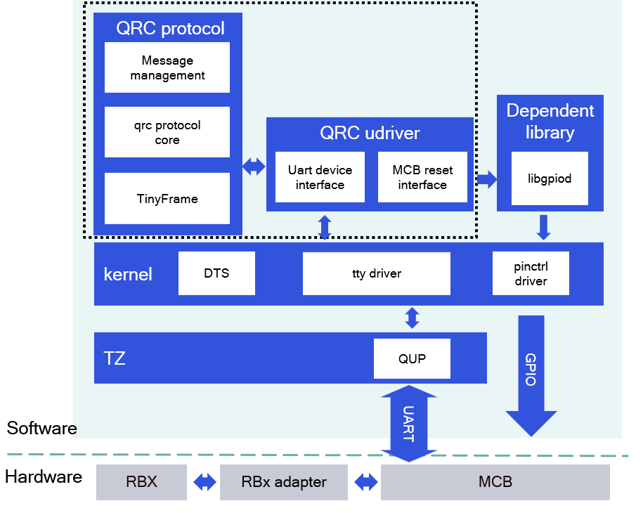

<div align="center">
  <h1>LIBQRC</h1>
  <p align="center">
   
  </p>
  <p>a library to communicate between APPs and motor control board</p>
  <a href="https://ubuntu.com/download/qualcomm-iot" target="_blank"></a>
  <a href="https://docs.ros.org/en/jazzy/" target="_blank"></a>
</div>

---

## 👋 Overview

This library is used for Qualcomm-specific AMR.  
**libqrc** is is a dynamic library designed to facilitate robust and efficient communication between applications and the Motor Control Board (MCB).  
It serves as an abstraction layer, providing APIs for upper-layer applications, covering transport protocol management, message handling, and low-level device operationsa.

<div align="center">
  
</div>

<br>

LIBQRC includes two components: QRC protocol and QRC user driver.  
The QRC protocol, which is based on the TinyFrame protocol, is designed for upper-layer robotics applications, while the QRC user driver is responsible for invoking low-level drivers.  
When upper-layer applications need to send data to the MCB, the QRC protocol encapsulates the data, which is then transmitted to the MCB via the QRC user driver. Similarly, data returned from the MCB is received by the QRC user driver and parsed by the QRC protocol.

---

## 🔎 Table of Contents
  * [APIs](#-apis)
    * [`libqrc` APIs](#-libqrc-apis)
    * [`libqrc-udriver` APIs](#-libqrc-udriver-apis)
  * [Supported Targets](#-supported-targets)
  * [Installation](#-installation)
  * [Usage](#-usage)
  * [Contributing](#-contributing)
  * [License](#-license)

---

## ⚓ APIs

### 🔹 `libqrc` APIs
Please see [libqrc/include/module/qrc_msg_management.h](libqrc/include/module/qrc_msg_management.h)
#### simple example
```c
#include "qrc_msg_management.h"
#include "client_control_msg.h"

int main(int argc, char ** argv)
{
    struct qrc_pipe_s * pipe_ = nullptr;
    char *data = "hello";
    size_t len = strlen(data);
    bool ack = true;

    init_qrc_management();  //initialize qrc procotol
    pipe_ = qrc_get_pipe(CLIENT_PIPE);  //get a new or exited pipe
    auto callback = [](struct qrc_pipe_s *, void * data, std::size_t, bool) {
        message_handle(data);   //user-defined
    };
    qrc_register_message_cb(pipe_, callback);   //register callback function of pipe
    qrc_write(pipe, (uint8_t *)data, len, ack); //write data with lock
}
```

### 🔹 `libqrc-udriver` APIs
Please see [libqrc-udriver/include/qti_qrc_udriver.h](libqrc-udriver/include/qti_qrc_udriver.h)
#### simple example
```c
#include "qti_qrc_udriver.h"

int main(int argc, char ** argv)
{
    ssize_t num = -1;
    size_t length = 10;
    char * tx_buffer = (char *)malloc(length);
    memcpy(tx_buffer, "hello", 6);

    int fd = qrc_udriver_open();    //open tty device
    qrc_udriver_tcflsh(fd); //flush the input and output buffer of the tty device
    qrc_udriver_write(fd, tx_buffer, length);   //write data to tty device
    free(tx_buffer);
    qrc_udriver_close(fd);  //close tty device
}
```

---

## 🎯 Supported Targets

<table >
  <tr>
    <th>Development Hardware</th>
    <th>Hardware Overview</th>
  </tr>
  <tr>
    <td>Qualcomm Dragonwing™ RB3 Gen2</td>
    <th><a href="https://www.qualcomm.com/developer/hardware/rb3-gen-2-development-kit"></a></th>
  </tr>
    <tr>
    <td>Qualcomm Dragonwing™ IQ-9075 EVK</td>
    <th><a href="https://www.qualcomm.com/products/internet-of-things/industrial-processors/iq9-series/iq-9075"></a></th>
  </tr>
</table>

<table >
  <tr>
    <th>Dependent Hardware</th>
    <th>Hardware Overview</th>
    <th>Description</th>
  </tr>
  <tr>
    <td>Motor Control Board</td>
    <th></th>
    <td>This board needs to be plugged into the Development Hardware.</td>
  </tr>
</table>

---

## ✨ Build from source code

> [!IMPORTANT]
> **PREREQUISITES**: The following steps need to be run on **ROS Jazzy**.<br>
> Reference [Install ROS Jazzy](https://docs.ros.org/en/jazzy/index.html) to setup environment. <br>
> For Qualcomm Linux, please check out the [Qualcomm Intelligent Robotics Product SDK](https://docs.qualcomm.com/bundle/publicresource/topics/80-70018-265/introduction_1.html?vproduct=1601111740013072&version=1.4&facet=Qualcomm%20Intelligent%20Robotics%20Product%20(QIRP)%20SDK) documents.

Install dependencies:

```bash
sudo apt update
sudo apt install -y libgpiod-dev=1.6.3-1.1build1
```

Download the source code and build with colcon:

```bash
source /opt/ros/jazzy/setup.bash && \
mkdir -p ~/ros_ws/src && cd ~/ros_ws/src && \
git clone https://github.com/qualcomm-qrb-ros/libqrc.git && \
sudo cp libqrc/rules/99-qcom-qrc.rules /usr/lib/udev/rules.d/ && \
sudo udevadm control --reload-rules && sudo udevadm trigger && \
cd ~/ros-ws/ && \
colcon build
```

---
## 🚀 Usage

> [!IMPORTANT]
> **PREREQUISITES**:The Motor Control Board needs to be plugged into the Qualcomm device.

1.For specific applications, please see [qrb_ros_robot_base](https://github.com/qualcomm-qrb-ros/qrb_ros_robot_base)

2.Test the communication between the Qualcomm device and The Motor Control Board
  ```bash
    # On the Motor Control Board
    uart_test_app

    # On the Qualcomm device
    cd ~/ros-ws/ && \
    source install/local_setup.bash && \
    qrc_udriver_test -s 10 -t 10

  ```
---

## 🤝 Contributing

Thanks for your interest in contributing to libqrc! Please read our [Contributions Page](CONTRIBUTING.md) for more information on contributing features or bug fixes. We look forward to your participation!

---

## 📜 License

Libqrc is licensed under the BSD-3-clause "New" or "Revised" License. 

Check out the [LICENSE](LICENSE) for more details.
